# GitHub Actions Workflow Dependencies

This document explains the GitHub Actions workflow setup and how code quality checks are enforced.

## Workflow Structure

```mermaid
flowchart TD
    A[Code Push/PR] --> B[Code Quality Workflow]
    B --> C[Pre-commit Checks]
    B --> D[Go Linting & Tests]
    B --> E[Security Scanning]

    C --> F{All Quality Checks Pass?}
    D --> F
    E --> F

    F -->|Yes| G[Build Workflow]
    F -->|Yes| H[Dev Build Workflow]
    F -->|No| I[❌ Block Build/Package]

    G --> J[Cross-platform Building]
    G --> K[Package Creation]

    H --> L[Development Builds]
    H --> M[Development Packages]
```



## Workflow Files

### 1. **code-quality.yml** (Primary Quality Gate)

**Triggers:**
- Push to `main` or `develop` branches
- Pull requests to `main`
- Called by other workflows
- Manual dispatch

**Jobs:**

#### `pre-commit` Job
- Runs all pre-commit hooks configured in `.pre-commit-config.yaml`
- Checks for trailing whitespace, file endings, YAML syntax, etc.
- Uses Python 3.11 and caches pre-commit dependencies

#### `go-checks` Job (depends on pre-commit)
- Go code formatting verification (`gofmt`)
- Go static analysis (`go vet`)
- Unit tests with race detection and coverage
- Uploads coverage to Codecov (optional)
- Caches Go modules for faster builds

#### `security-scan` Job (depends on pre-commit)
- Runs gosec security scanner
- Generates SARIF security report
- Uploads results to GitHub Security tab

### 2. **build.yml** (Production Builds)

**Dependencies:**
- ✅ **Requires `code-quality` workflow to pass first**
- Only runs cross-platform builds if quality checks succeed

**Changes Made:**
- Added `code-quality` job that calls the reusable workflow
- `test` job now depends on `code-quality` completion
- `build` job depends on `test` job completion

### 3. **dev-build.yml** (Development Builds)

**Dependencies:**
- ✅ **Requires `code-quality` workflow to pass first**
- Only creates development packages if quality checks succeed

**Changes Made:**
- Added `code-quality` job dependency
- `setup` job now waits for quality checks

## Quality Gates Enforced

### ❌ **Builds are BLOCKED if:**
- Pre-commit hooks fail (trailing whitespace, YAML errors, etc.)
- Go code is not properly formatted
- `go vet` finds suspicious constructs
- Unit tests fail
- Security scanner finds critical issues

### ✅ **Builds PROCEED only when:**
- All pre-commit hooks pass
- Go code is properly formatted
- All static analysis checks pass
- All unit tests pass with race detection
- No critical security issues found

## Local Development Workflow

To ensure your code passes CI checks before pushing:

```bash
# 1. Run all quality checks locally
make check

# 2. Run pre-commit hooks manually
make pre-commit

# 3. Build and test application
make build
./golang-cli --help

# 4. Commit (pre-commit hooks run automatically)
git add .
git commit -m "Your changes"

# 5. Push (triggers GitHub Actions)
git push
```

## CI/CD Pipeline Flow

1. **Developer pushes code** → Triggers workflows
2. **Code Quality Workflow runs** → All quality gates must pass
3. **Build Workflow triggered** → Only if quality checks passed
4. **Cross-platform builds** → Creates binaries for all platforms
5. **Package creation** → Generates distribution packages
6. **Release artifacts** → Available for download/deployment

## Benefits

### 🛡️ **Quality Assurance**
- No code reaches production without passing quality checks
- Consistent code formatting and style
- Security vulnerabilities caught early
- Test coverage monitoring

### 🚀 **Developer Experience**
- Fast feedback on code quality issues
- Cached dependencies for faster builds
- Clear error messages when checks fail
- Local tooling matches CI environment

### 📊 **Visibility**
- Code coverage reports
- Security scan results in GitHub Security tab
- Clear dependency chain in Actions UI
- Failed checks block dangerous deployments

## Customization

### Adding New Quality Checks
Edit `.github/workflows/code-quality.yml` to add new jobs or steps.

### Modifying Pre-commit Hooks
Edit `.pre-commit-config.yaml` to add/remove hooks.

### Adjusting Go Linting
Edit `.golangci.yml` to configure additional linters.

### Changing Workflow Dependencies
Modify the `needs:` clauses in workflow files to change execution order.

The setup ensures that **quality comes first** - no builds or packages are created unless the code meets all quality standards.
